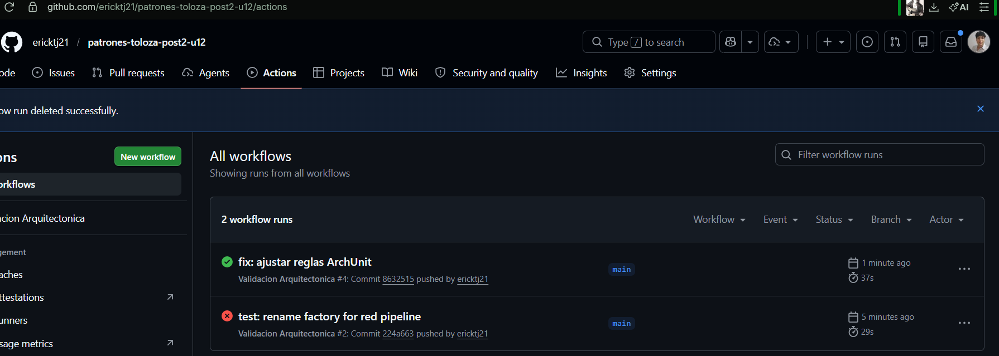
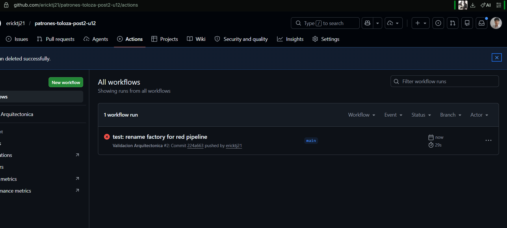

# U12 Post 2 - Validacion Arquitectonica

## Resumen
Repositorio basado en el Post 1 con reglas ArchUnit, ADRs y pipeline de CI para
validar la arquitectura en cada push.

## Validacion Arquitectonica (ArchUnit)
- Regla 1: el dominio no depende de infraestructura ni adaptadores.
- Regla 2: los controladores solo acceden a la facade.
- Regla 3: los puertos del dominio son interfaces.
- Regla 4: los procesadores implementan `ProcesadorPedido`.
- Regla 5: la infraestructura no accede a adaptadores REST.

Archivo de reglas: src/test/java/com/empresa/pedidos/ReglasArquitectura.java

## ADRs
- [docs/adr/ADR-001.md](docs/adr/ADR-001.md)
- [docs/adr/ADR-002.md](docs/adr/ADR-002.md)
- [docs/adr/ADR-003.md](docs/adr/ADR-003.md)

## Pipeline CI
- Workflow: .github/workflows/arquitectura.yml
- Ejecuta `mvn test -Dtest=ReglasArquitectura` y `mvn verify`.

## Capturas

## Ejecucion local
1. Solo reglas: `mvn test -Dtest=ReglasArquitectura`.
2. Suite completa: `mvn verify`.
